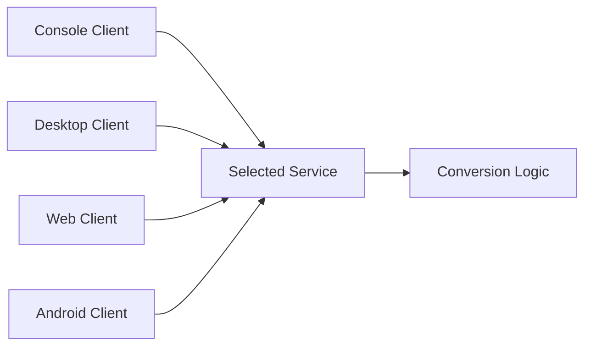

# Unit Converter — Multi-Architecture

This project is a unit conversion system built with Java and .NET. It shows how the same system can use SOAP or REST services and different client types.

## Overview

The project was created to compare service architectures. Each version provides authentication and unit conversion operations through its own backend and clients.

## Main Features

- User authentication
- Temperature conversions
- Length conversions
- Weight conversions
- SOAP and REST service calls
- Console, desktop, web, and Android clients

## Architecture

The repository contains four separate implementations:

- Java SOAP
- .NET SOAP
- Java REST
- .NET REST



## Applications

| Application | Technology | Purpose |
| --- | --- | --- |
| Backend services | Java or .NET | Provide authentication and conversions |
| Console clients | Java or C# | Use the services from a terminal |
| Desktop clients | Java Swing or .NET | Provide a desktop interface |
| Web clients | JSP/Servlets or ASP.NET MVC | Provide browser access |
| Mobile clients | Kotlin / Android | Provide mobile access |

## Tech Stack

### Backend

- Java
- Jakarta XML Web Services and Jakarta REST
- C# and ASP.NET

### Clients

- Java Swing
- JSP and Servlets
- ASP.NET MVC
- Kotlin and Android

### Communication

- SOAP
- REST

### Tools

- Maven
- Gradle
- Visual Studio solutions

## Project Structure

```text
unit-converter-multi-architecture/
├── TI1.1 SOAP_JAVA_SINBDD_GR09/
├── TI1.2 SOAP_DOTNET_SINBDD_GR09/
├── TI1.3 RESTFUL_JAVA_SINBDD_GR09/
└── TI1.4 RESTFUL_DOTNET_SINBDD_GR09/
```

Each folder contains a backend and its console, desktop, web, and mobile clients.

## Getting Started

Choose one architecture first. Build Java modules from the folder that contains `pom.xml`. Open Android modules in Android Studio. Open .NET applications with their `.sln` files in Visual Studio. Start the selected backend before its clients and set local service URLs when needed.

## Screenshots

Screenshots will be added soon.

## Academic Context

This project was developed as part of a university software architecture course. The main goal was to compare Java, .NET, SOAP, REST, and several client platforms.
